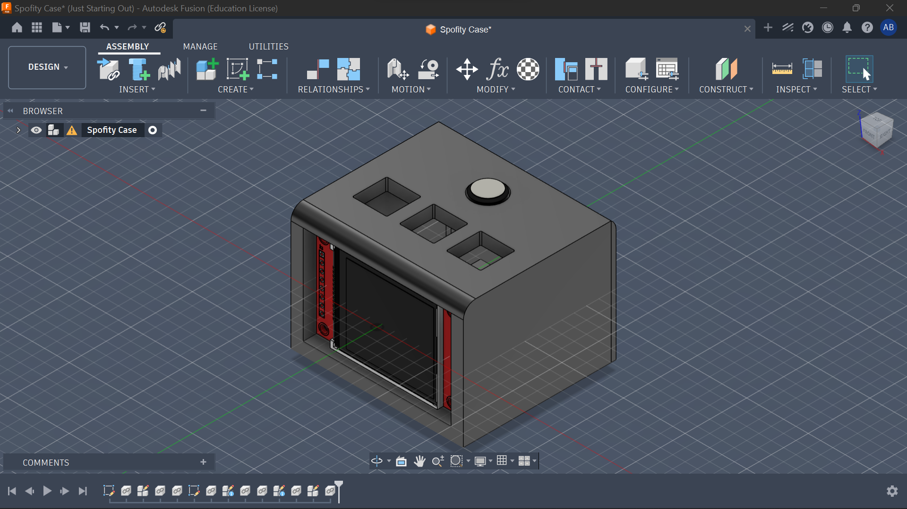
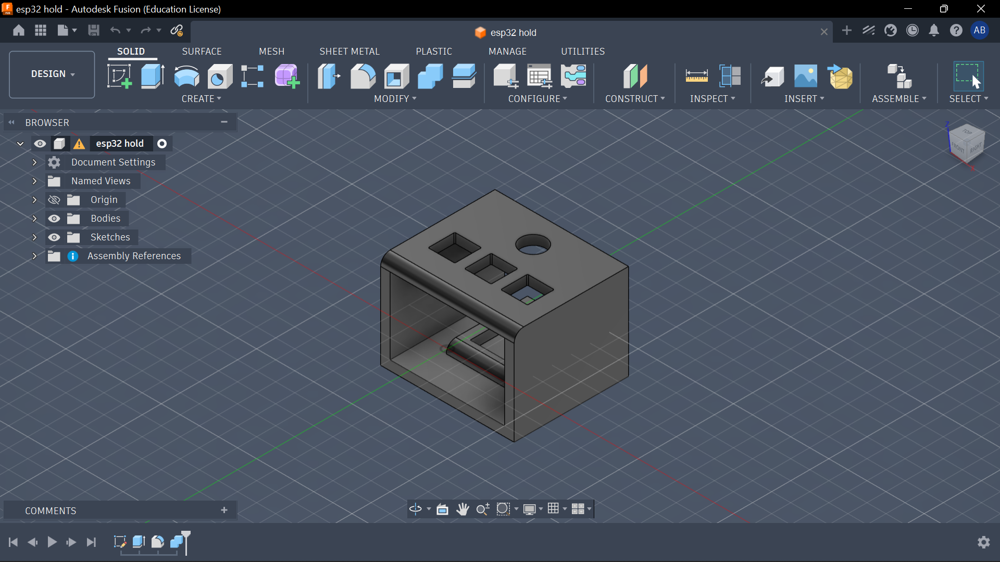
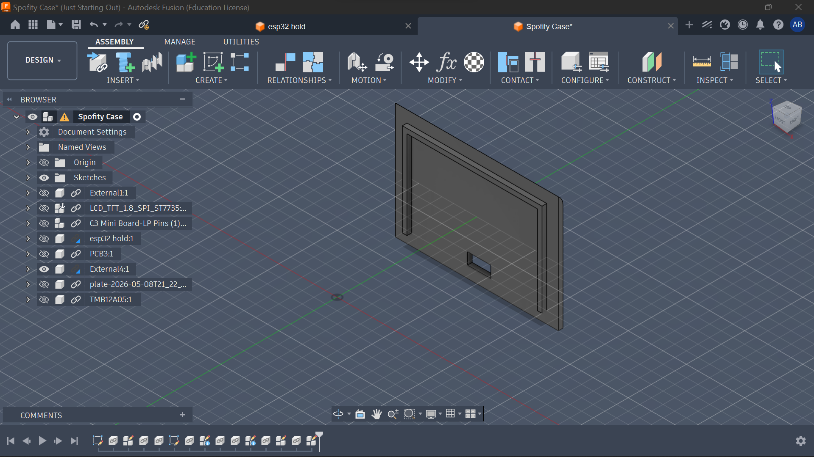

# Spotifyyyyyyyyy 🎵

my version of the spotify display starter project — shows whats currently playing and lets me skip/play songs with actual keyboard switches. also threw in a buzzer for button feedback cause why not.

## Why i made this

i hate picking up my phone just to skip a song while im working or studying. wanted something that just sits on my desk, shows me whats playing, and lets me control it without touching my phone. also i wanted to finally learn how WiFi on a microcontroller works and this was the perfect excuse for that.

## How it works

- **ESP32-C3** connects to WiFi and talks to the Spotify API
- **1.8" ST7735 TFT display** shows the current track and artist
- **Gateron keyboard switches** to skip, go back, and play/pause
- **Passive buzzer** clicks whenever you press a button
- everything sits in a **3D printed case** from JLCPCB

## Screenshots

## BOM

| Item # | Name | Purpose | Qty | Total (USD) | Source | Link |
|--------|------|---------|-----|-------------|--------|------|
| 1 | 3D Printing Case | To hold the display | 1 | $6.30 | JLCPCB | [link](https://jlcpcb.com/) |
| 2 | Gateron Switches Mechanical Keyboard | To switch between songs | 5 | $5.10 | AliExpress | [link](https://www.aliexpress.com/item/1005006091988869.html?spm=a2g0o.detail.0.0.5e95NUgkNUgktJ&mp=1&pdp_npi=6%40dis%21USD%21USD+6.00%21USD+5.10%21%21USD+5.10%21%21%21%4021038da617783638114353499ee3e4%2112000035698597737%21ct%21NG%216438462769%21%211%210%21) |
| 3 | ESP32-C3 Development Board | The MCU | 1 | $2.64 | AliExpress | [link](https://www.aliexpress.com/item/1005005319963906.html?spm=a2g0o.detail.0.0.446dsOXTsOXTVg&mp=1&pdp_npi=6%40dis%21USD%21USD+2.64%21USD+2.64%21%21USD+2.64%21%21%21%402103894417783635684454404e7cb5%2112000033892432204%21ct%21NG%216438462769%21%211%210%21) |
| 4 | 1.8" TFT LCD Display Module ST7735S 3.3V | The display unit | 1 | $3.36 | AliExpress | [link](https://www.aliexpress.com/item/1005006139989470.html?spm=a2g0o.cart.0.0.694038daEUMwtx&mp=1&pdp_npi=6%40dis%21USD%21USD+3.36%21USD+3.36%21%21USD+3.36%21%21%21%40210390c917783625114627336e4281%2112000047162642428%21ct%21NG%216438462769%21%211%210%21) |
| | | | | Shipping: $11.55 | | |
| | | | | **TOTAL: $28.95** | | |